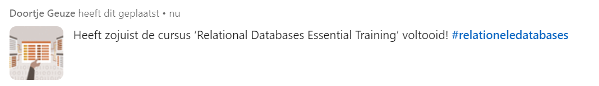

# LinkedIn cursus Relational Databases Essential Training

## introductie
- informatie managen
- Efficiënt om data op te slaan
- makkelijk om data op te halen
- Flexiebel

## introductie rationele database
- Keys → data dat wordt gebruikt om aanvullende details gerelateerde tabellen op te zoeken.
- Keys zijn efficiënter
- ze nemen minder date op omdat data niet dubbel in de database staat
- data opvragen: queries

### Keys
- Surrogate key: Zelf bedachte key die nog niet in de database zat (meestal een ID)
- Composite key: Key die is samengesteld van meerdere waarden (bijvoorbeeld voor- en achternaam)

### RDBMS tasks
- Relational database management system
- create and modify the structure of data
- define tables and column names
- create key value column and create relationships
- Manipulatie data records and perform CRUD tasks:
    - create
    - read
    - update
    - delete

QL Server, Access, Oracle, and PostgreSQL = RDBMS

## Keyword
- Met de UNIQUE keyword kan je zorgen dat een kolom een unieke waarde heeft.
- NULL betekent dat er geen data is ingevoerd. Met NOT NULL zorg je ervoor dat de data moet worden ingevoerd.
- Met DEFAULT kan je een standaardwaarde invoegen voor een waarde in de tabel.

Met indexes worden waarden in een tabel sneller gevonden. 
Primary keys zijn een voorbeeld van indexes.

## Relaties
- Je kan relaties maken tussen tabellen. Bij een 1 to many relatie wordt de primary key in de ene tabel de foreign key in de andere tabel.

- Optionality -> geeft aan of er een relatie is waarbij er slechts 1 of geen mogelijkheid is (Een klant moet een bestelling hebben -> optionality = 1).
- Cardinalty -> geeft aan of er een relatie is waarbij er 1 of meerdere mogelijkheden zijn (Een product kan meerdere leveranciers hebben -> cardinality = n).

Optionality en Cardinality zijn te visualiseren in one to one en one to many relaties.

## Tabelen
- Self joins: Een tabel met relaties binnenin de tabel. Bijvoorbeeld een tabel met de waarden employees en supervisors. Een supervisor kan meerdere employees hebben, terwijl een employee, maar 1 supervisor kan hebben.
- Cascade changes: Wijzigingen in een tabel worden meteen doorgevoerd in de andere tabellen. 

SQL-statements die je hiervoor kan gebruiken zijn ON UPDATE CASCADE en ON DELETE CASCADE.

- First normal form: Een tabel heeft alleen kolommen met slechts één waarde.
- Second normal form: ?
- Third normal form: Verschillende kolommen in dezelfde tabel moeten niet dezelfde informatie bevatten (CA = California)

Met inner join kan je gegevens uit verschillende tabellen samenvoegen.

## Resultaten LinkedIn Learning cursus

