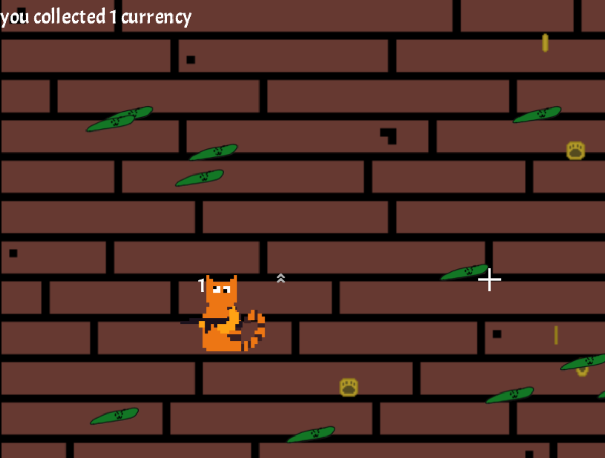

# Fast enemy aanmaken (aka komkomer)

## Doel

Het doel is om een andere enemy te hebben. deze enemy gaat sneller dan de normale enemy

## wat is daar voor nodig

- fast enemy class
- spawn functie voor de fastenemies
- fastenemies toevoegen aan een enemyList
## Progess

fast Enemy class:

```c#
//Class FastEnemy
namespace Blok3Game.GameObjects
{
    public class FastEnemy : Enemy
    {
        public int EnemyHitPoints;
        public new int EnemyMoveSpeed = 10;
        
        public FastEnemy(int hitPoints, int moveSpeed, Vector2 position) : base(hitPoints, moveSpeed, position, "Images/Characters/fastEnemy", 0, " ", 0)
        {
            EnemyHitPoints = hitPoints;
            EnemyMoveSpeed = moveSpeed;
        }
    }
}
```
variable fast enemy:
```c#
public FastEnemy fastEnemy;

```
fast enemy woordt toegevoegd als de speler een upgrade heeft opgepakt.
```c# 
// Al heeft de speler eem upgrade opgepakt gaat de wave verder
else if (pickedUpPurple || pickedUpYellow)
                        {
                            WaveCounter++;
                            NewWave = true;
                            WaveIndicatorShowTime = 0;
                            ResetBullets();
                            SpawnFastEnemies();
                        }
```
Al gaat de fast enemy dood woordt hij aan de remove list toegevoegd
```c#
// Fast enemys aan de remove list toevoegen
if (gameObject is FastEnemy fastEnemy)
                {
                    EnemyList.Remove(fastEnemy);
                }
```
De functie voor het spawnen van de fast enmeies.
```c#
//Fast enemies spawnen
private void SpawnFastEnemies()
        {
            Random random = new Random();

            int swap = 0;
            //For-loop om meerdere enemies aan te maken
            for (int i = 0; i < 10 * WaveCounter; i++)
            {
                int XPosition, YPosition;

                //Willekeurige posities waar de enemies spawnen
                XPosition = random.Next(0 - 300, GameEnvironment.Screen.X + 700);
                YPosition = random.Next(0 - 300, GameEnvironment.Screen.Y + 700);


                //Do-While loop die ervoor zorgt dat de enemies aan de buiten randen spawnen 
                //De swap variabele zorgt ervoor dat de enemies evenredig worden verdeel aan alle kanten
                do
                {
                    if (swap % 2 == 0)
                    {
                        XPosition = random.Next(0 - 300, GameEnvironment.Screen.X + 700);
                        swap++;
                    }
                    else
                    {
                        YPosition = random.Next(0 - 300, GameEnvironment.Screen.Y + 700);
                        swap++;
                    }

                } while (XPosition >= 0 - 200 && XPosition <= GameEnvironment.Screen.X + 200 &&
                         YPosition >= 0 - 200 && YPosition <= GameEnvironment.Screen.Y + 200);

                //Aanmaken van de enemies
                fastEnemy = new FastEnemy(1, 3, new Vector2(XPosition, YPosition));

                EnemyList.Add(fastEnemy);
                Add(fastEnemy);
            }
        }
```

## resultaat:
