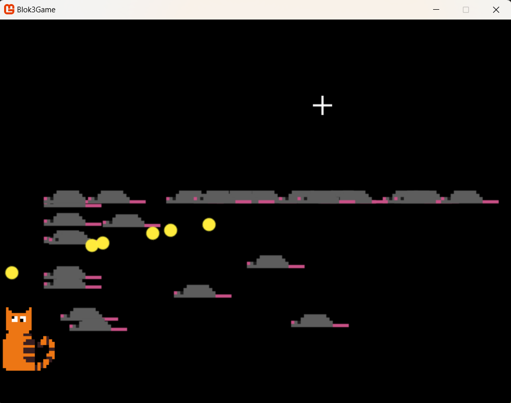
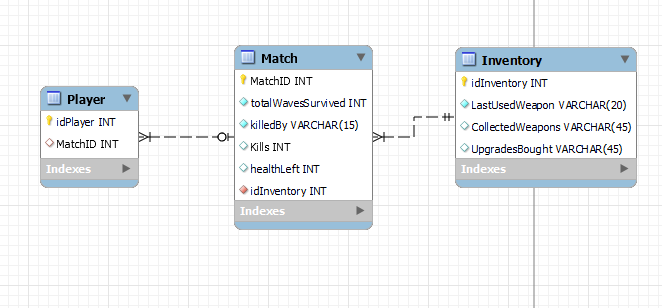

# Product review Sprint 1

## K2
Voor deze sprint hebben wij een prototype gemaakt, wij hebben gekozen om deze in Monogame te maken. Voor dit prototype hebben we concept art gebruikt. Het prototype bestaat uit: een gameloop (de speler kan bewegen, winnen en verliezen), er zijn vijanden die bewegen en kunnen schieten en er is interactie tussen speler en vijand.

Verder is er ook een Database/EER-ontwerp van analytics gemaakt voor deze game.

## K4
Voor ons project hebben we een game design document gemaakt. Hier staat een beschrijving in van onze concepten en mechanics, een inspiratie analyse en 1 game design theorie toegepast op ons project.

[Game Design Document](https://suuleewooyaa34-propedeuse-hbo-ict-onderwijs-2023-379a4339aa11c7.dev.hihva.nl/Groepje/Game-design/)

## G2 en G4
Wij hebben een onderzoek gedaan naar onze doelgroep, dit hebben we gedaan door middel van een survey te houden. Deze hebben we gestuurd naar meerdere vrienden en kennissen, die binnen onze doelgroep van 16-25 jaar oud passen.

[survey](https://docs.google.com/forms/d/1FivExYb0LXbCOSD4Vz9-DgLNRBpKKrlBVcoj90mwMfI/viewform?edit_requested=true) 

De uitslagen van deze survey kan je hieronder vinden.

[uitslagen survey](https://icthva-my.sharepoint.com/:w:/g/personal/doortje_geuze_hva_nl/EesPOxRipSJDnMWAxso4mUwB2si3BOiy7bQWhq1Gserc2w)

## Powerpoint
Hieronder staat de link naar de powerpoint van de product review op donderdag 25-4-2024.

[powerpoint](https://icthva-my.sharepoint.com/:p:/g/personal/doortje_geuze_hva_nl/ET2KNq-a9dVCk9MSghZM9c0B4TnQk839jBKlGgmF1swbtw?e=cYC78s)