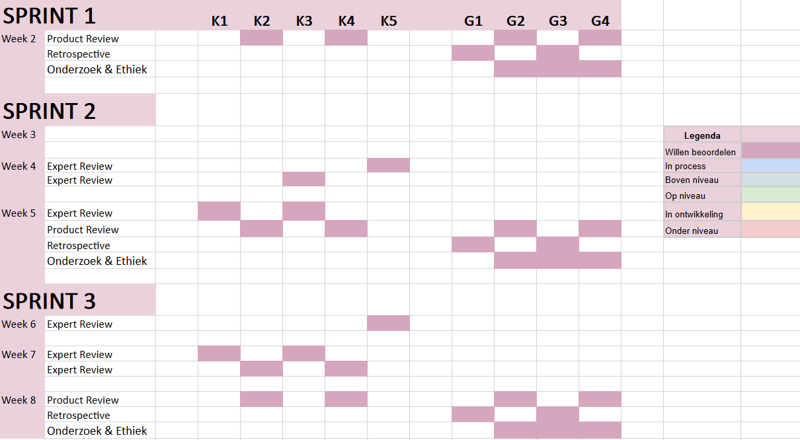

# Inhaal Opdracht Sed
## Planning sprint 1

[Link naar excel sheet](https://icthva-my.sharepoint.com/:x:/g/personal/sed_van_hesselingen_hva_nl/EU5QZ1gfGR5JoDzw_2NRnZUBbE_iQ7dBfTACD_VwVaqQRQ?e=FuknFw)

Vorig blok had ik problemen met het inplannen van wanneer ik mijn K en G criteria zou halen. Hierdoor ronde ik het blok af met een 5,5 als eindcijfer. Ik heb voor dit blok daarom een planning gemaakt dat ik elke week bij hou die laat zien wanneer ik welke criteria en welke ik al beoordeeld heb, zodat ik dit blok kan afronden met een ruime voldoende.
