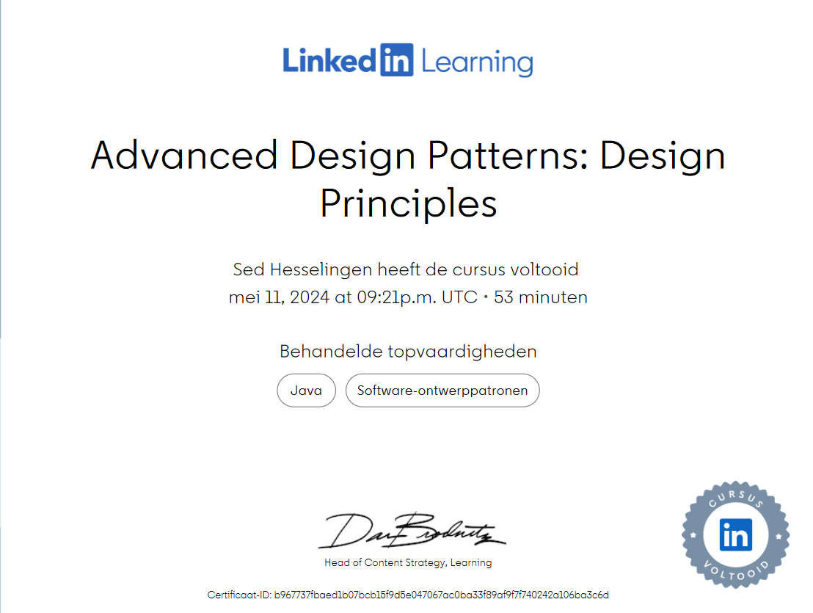
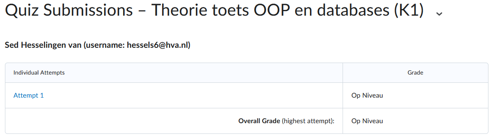

# Design Principles C#

## Introductie

### Design Principles
Design Priciples zijn richtlijnen die helpen met het verbeteren van het objectgeoriënteerde ontwerp en het voorkomen van slecht objectgeoriënteerd ontwerp. Het zijn een extra reeks richtlijnen boven op de object-oriented concepts (zoals Inheritance).
Er is geen standaard catalogus voor deze principles. De principles verschillen per vakgebied in de ICT en met wie je praat.

### Design Patterns
Design patterns zijn een gevolg van Design Priciples te volgen. Over tijd heeft dit geresulteerd tot een reeks terug komende patronen. Deze patterns gebruiken we voor hoe we grotere objectgeoriënteerde ontwerp structereren.

### Symptonen van een slecht ontwerp
- Het is moeilijk te veranderen vanwege sommige afhankelijkheden
- Als iets in de code verandert breken er niet-gerelateerde delen
- Het kan niet hergebruikt worden op plaatsen waar het niet voor ontworpen was

### Fundamental Principles
- Encapsuleer wat varieert
- Een voorkeur aan samenstelling boven inheritance
- Programeer naar interfaces
- Losse Kopelingsprincipe, streef voor losjes gekoppelde ontwerpen tussen objecten die op elkaar inwerken
- S(ingle responsibilty) O(Open/Closed) L(iskov substitutie) I(nterfacescheidings) D(ependency inversion)

## The Principles

### Encapsulation what varies
Encapsulate what varies is een principe dat de basis vormt voor alle andere ontwerppatronen. Met dit principe identificeer je wat er in je applicatie varieert en die scheid van wat er hetzelfde blijft.

### Favor composition over inheritance
Door een HAS-A relatie (Composition) ipv een IS-A relatie (Inheritance) te gebruiken maak je je code een stuk flexibeler en laat gedrags veranderen tijdens run time.

### Loose coupling
Loose coupling zorgt voor een verkleinde afhankelijkheid tussen components. Door dit toe te passen kan je in een class iets veranderen zonder dat de andere class(es) breekt.

### Program to interfaces
Betekent eigenlijk "Program to a super type". Het helpt met het toepassen van polymorphisme en versimpelt de uitbreidbaarheid van de code.

### SOLID

#### Single Responsibilty Principle
Een class moet maar 1 reden hebben om te veranderen. De verantwoordelijkheid van een class moet worden gelimiteert zodat de verandering in die class zo min mogelijk is. Dit principe heeft geen duidelijke richtlijn en is daarom moeilijk om correct te krijgen. Door dit principe toe te passen kunnen er delen van je code hergebruikt worden zonder dat er veel verandert hoeft te worden.

#### Open-closed Principle
Object georienteerde designs zijn open voor uitbreiding maar dicht voor veranderingen. Dit principe zorgt ervoor dat bestaande code niet hoeft te worden verandert om nieuw gedrag toe te voegen.

#### Liskov's Substitution Principle
Subtypes moeten altijd vervangbaar kunnen zijn voor hun base type.

#### Interface Segregation Principle
Scheid code in de interface waar nodig zodat het samenhangend blijft en makkelijker te onderhouden.

#### Dependency Inversion Principle
Hight tier modules zouden niet moet afhangen van low tier moduels. Dit kan gedaan worden aan de hand van een abstrabte class. De abstractie volgt ervoor dat code dat niet gezien hoeft te woorden door andere delen in de code.

## Relevantie tot je project en praktische toepassing

Design Principles zijn richtlijnen die je het liefst tijdens het coderen altijd toepast.

De design principle Loose coupling is een design principle die goed toegepast kan worden op ons project. Wij zijn van plan veel veschillende enemies te hebben die allemaal iets anders hebben (zoals sneller schieten, sneller lopen), dus zal er veel verandert worden in dat deel van de code. Met loose coupling breken we niet de rest van de code zoals van de player of van het spel zelf.

Van de SOLID is de Open-Close Principle handig om te gebruiken. Dit is vooral relevant voor de speler sinds daar soms nieuwe features bijkomen (zoals het op kunnen pakken van coins of dash) maar dan willen we niet dat de code van het lopen of de HP van de speler breekt/verandert hoeft te worden sinds dat niet relevant is bij die features. 

## Resultaten LinkedIn Learning cursus

## Resultaten quiz op DLO

## Vragen voor expert review

