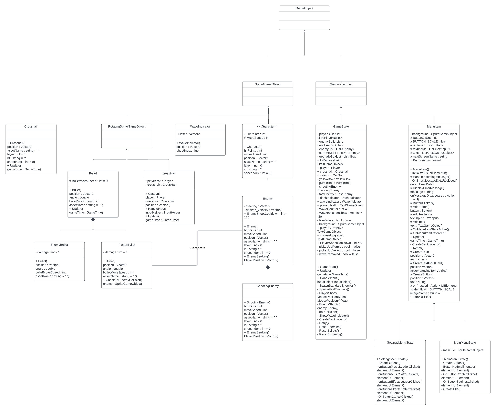
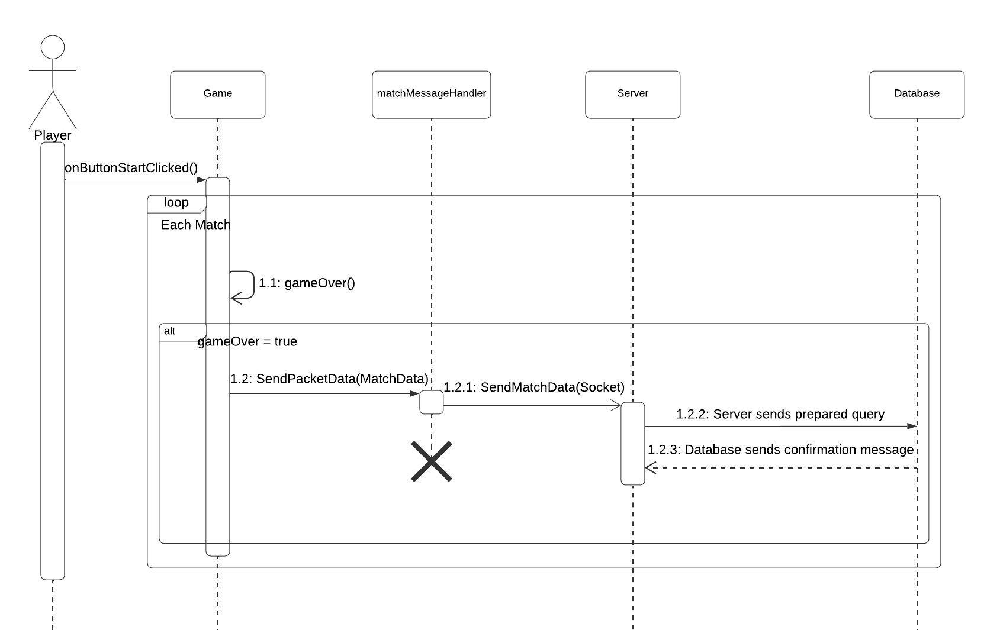
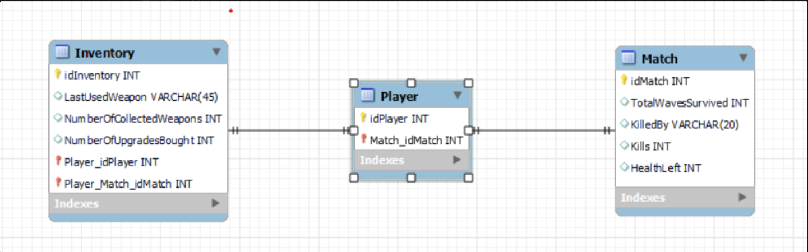

# Expert Review Sed Sprint 3

## Linked-in Courses
- [Design principles](../LinkedIn-Cursus/design-principles.md)
- [Interface and Generics](../LinkedIn-Cursus/interfaces-and-generics.md)
- [Data structures](../LinkedIn-Cursus/data-structures.md)

## K1
### Klassendiagram
Op basis van wat ik tot nu toe heb toegevoegd aan het project heb ik een klassendiagram [(Lucid Software, 2023)](https://youtu.be/6XrL5jXmTwM?si=odueNk4dJfThpLdw) gemaakt. Ik heb hierin (Rotating)SpriteGameObject, GameObject en GameObjectlist leeg gelaten omdat ik hieraan niks verandert heb en het niet door mij gemaakt is.





### OOP

#### Encapsulation
Encapsulation is een van de kernconcepten bij objectgeoriënteerd programmeren en beschrijft het bundelen van gegevens en methoden. Encapsulation wordt bijvoorbeeld gebruikt om de interne representatie of toestand van een object voor de buitenkant te verbergen [(Stackify, 2024)](https://stackify.com/oop-concept-for-beginners-what-is-encapsulation/).

=== "Public"
    Character.cs
    ```c#
    public abstract class Character : SpriteGameObject
    {
        public int HitPoints;
    //more code
    }
    ```
    Een karakter heeft hitpoints die op het scherm worden laten zien en die naar beneden gaan wanneer het geraakt wordt door bijvoorbeeld een bullet of een enemy. Daarom moet code buiten de Character class erbij kunnen komen om het niet alleen te weergeven maar ook om het naar beneden te laten gaan wanneer nodig.

=== "Protected"
    Protected methods en properties mogen alleen gebruikt worden door de class zelf of door classes die inheriten van die class.

    Character.cs
    ```c#
    public abstract class Character : SpriteGameObject
    {
        protected int MoveSpeed;
    //more code

    ```

    De baseclass Character heeft een default movespeed die doorgegeven wordt aan alle classes die hiervan inheriten omdat elke karakter een movement speed nodig heeft. Dit hoeft alleen verandert te worden in de Classes die inheriten van Character zelf en niet daarbuiten.

=== "Private"
    Private methods en properties mogen alleen gebruikt worden door de class zelf.

    Crosshair.cs
    ```c#
    private Vector2 steering;
    private Vector2 desired_velocity;

        public void EnemySeeking(Vector2 PlayerPosition) // Made with the help of https://code.tutsplus.com/understanding-steering-behaviors-seek--gamedev-849t
        {
            desired_velocity = PlayerPosition - position;
            desired_velocity.Normalize();
            desired_velocity *= EnemyMoveSpeed;

            steering = desired_velocity - velocity;

            steering = steering / 5;
            velocity = velocity + steering;
            position += velocity;
        }
    ```
    Voor onze game willen we dat de enemies niet in een keer van directie veranderen als de speler van positie verandert maar dat ze in een mooie boog daar naartoe gaan. Dit wordt gedaan door middel van het berekenen van de gewilde velocity en dat + de steering te doen. Deze twee variabelen mogen alleen aangepast worden in deze Class en nergens daarbuiten dus zijn ze private.

#### Inheritance
Inheritance is een klasse uit een andere klasse afleiden voor een hiërarchie van klassen die een reeks attributen en methoden delen [(Stackify, 2023)](https://stackify.com/oop-concept-inheritance/).

Voor onze game wouden we graag nog een paar schermen hebben voordat je een lobby begint zoals een Main Menu en een Instellingen menu. Deze hebben veel eigenschappen hetzelfde zoals bijvoorbeeld de groote van de knoppen en de achtergrond. Daarom had ik er voor gekozen om een parent `MenuItem` class aan te maken waar al deze gelijke eigenschappen in staan. In het voorbeeld is te zien hoe `MainMenuStage` overneemt van `MenuItem` en gebruikt maakt van bijvoorbeeld de method `ButtonClicked()` om de stages te switchen.

=== "MenuItem.cs"

    ```c#
    public class MenuItem : GameObjectList
        {
            // more code...

            protected void ButtonClicked()
            {
                ButtonActive?.Invoke();
            }

            protected void AddButton(Button button)
            {
                Add(button);
                buttons.Add(button);
            }

            //more code...
        }
    }
    ```
=== "MainMenuState.cs"
    
    ```c#
    public class MainMenuState : MenuItem
    {
        //more code...

        private void OnButtonCreateClicked(UIElement element)
        {
            GameEnvironment.AssetManager.AudioManager.PlaySoundEffect("button_agree");
            nextScreenName = "GAME_STATE";
            ButtonClicked();
        }

        //more code...
    }
    ```

#### Abstraction
Abstraction is om met complexiteit om te gaan door onnodige details voor de gebruiker te verbergen, en alleen informatie die de user nodig heeft te laten zien [(Stackify, 2024)](https://stackify.com/oop-concept-abstraction/). 

=== "GameState.cs"

    ```c#
    if (player.HitPoints <= 0)
        {
            Retry();
            GameEnvironment.GameStateManager.SwitchToState("LOSE_SCREEN_STATE");
        
            // more code...
        }
    }
    ```
=== "Retry()"

    ```c#
    public void Retry()
    {
        //Reset Entities
        ResetEnemies();
        ResetBullets();
        ResetCurrency();

        //Reset everything Player
        player.InvulnerabilityCooldown = 0;
        player.HitPoints = player.BaseHitPoints;
        playerHealth.Text = $"{player.HitPoints}";
        pickedUpPurple = false;
        pickedUpYellow = false;

        //Reset the waves
        waveIndicator.Sprite.SheetIndex = 0;
        WaveCounter = 0;
    }
    ```

    Nadat de speler dood is gegaan willen we de game "resetten" terug naar wat het was toen de speler net begon. Dit hoeft natuurlijk niet allemaal worden laten zien hoe dat gedaan wordt en daarom wordt het in de gamestate alleen gecalled met Retry().

#### Polymorphisme
polymorfisme beschrijft het concept dat je via dezelfde interface of abstracte class toegang hebt tot objecten van verschillende typen. Elk type kan zijn eigen onafhankelijke implementatie van dit hebben [(Stackify, 2023)](https://stackify.com/oop-concept-polymorphism/).

=== "Character.cs"
    Wij maken gebruik van Polymorphisme in onze game met de Karakters. Elk Karakter in onze game neemt over van de parent abstract class `Character`. De class is abstract omdat we geen instantie willen maken van deze class. In deze class worden de hit points, move speed en position vasgesteld omdat elk karakter dat gebruikt in onze game.

    ```c#
    public abstract class Character : SpriteGameObject
    {
        //all variables that a character needs
        public int HitPoints;
        protected int MoveSpeed;

        public Character(int hitPoints, int moveSpeed, Vector2 position, string assetName = " ", int layer = 0, string id = "", int sheetIndex = 0) : base(assetName)
        {
            HitPoints = hitPoints;
            MoveSpeed = moveSpeed;
            Position = position;
        }
    }
    ```

=== "Enemy.cs"
    De class `Enemy` neemt over van Character en neemt daarom ook de base hit points, move speed en position over. De class implementeerd wel zelf de enemy seeking method, dit is omdat alleen karakters van het type Enemy moeten zoeken naar de player en niet de player zelf.

    ```c#
    public class Enemy : Character
    {
        private Vector2 steering;
        private Vector2 desired_velocity;
        public int EnemyShootCooldown = 120;

        public Enemy(int hitPoints, int moveSpeed, Vector2 position, string assetName, int layer = 0, string id = "", int sheetIndex = 0) : base(hitPoints, moveSpeed, position, assetName)
        {
        }

        public void EnemySeeking(Vector2 PlayerPosition) // Made with the help of https://code.tutsplus.com/understanding-steering-behaviors-seek--gamedev-849t
        {
            // more code...
        }
    }
    ```

### EER

Sinds onze game een singleplayer game is hebben wij voor een simpele analytics database gekozen. Als de player dood gaat wordt er naar de server  data van de match en wat de inventory was van de speler verstuurd. Zo kunnen wij terug zien in de analytics of een enemy, upgrade of wave veel te overpowered of moeilijk is.

### Principles

### Single responsibility principle
In onze game hebben wij 2 verschillende soorten bullets: PlayerBullet en EnemyBullet. Sinds in alle 2 de bullet classes op dezelfde manier bepaald moet worden wat de angle en de positie is vanaf waar hij geschoten wordt inheriten ze allebei van de abstract class Bullet. De player en enemy bullets kunnen alle 2 de snelheid en de hoeveelheid bullets veranderen aan de hand van upgrades of waves maar de basis bullet blijft altijd hetzelfde en zal niet verandert hoeven te worden.

=== "Bullet.cs"
    ```c#
    public abstract class Bullet : RotatingSpriteGameObject
        {
            protected int BulletMoveSpeed = 0;

            public Bullet(Vector2 position, double angle, int bulletMoveSpeed, string assetName) : base(assetName)
            {
                Position = position;
                Angle = (float)angle;
                BulletMoveSpeed = bulletMoveSpeed;
            }

            public override void Update(GameTime gameTime)
            {
                base.Update(gameTime);

                if (Position.X > 0 - Width && Position.X < GameEnvironment.Screen.X + Width && Position.Y > 0 - Width && 
                Position.Y < GameEnvironment.Screen.Y + Width)
                {
                    position += AngularDirection * BulletMoveSpeed;
                }
                else
                {
                    velocity = new Vector2(0, 0);
                }
            }
        }
    ```

=== "PlayerBullet.cs"
    ```c#
    public class PlayerBullet : Bullet
    {
        public int playerBulletCooldown = 2;
        public int damage = 1;

        public PlayerBullet(Vector2 position, double angle, int bulletMoveSpeed, string assetName = "Images/Characters/whiteCircle45") : base(position, angle, bulletMoveSpeed, assetName)
        {
        }

        public bool CheckForEnemyCollision(SpriteGameObject enemy)
        {
            if (CollidesWith(enemy))
            {
                return true;
            } return false;
        }
    }
    ```

=== "EnemyBullet.cs"
    ```c#
        public class EnemyBullet : Bullet
        {
            public EnemyBullet(Vector2 position, double angle, int bulletMoveSpeed, string assetName = "Images/Bullets/enemyBullet") : base(position, angle, bulletMoveSpeed, assetName)
            {
            }

            public bool CheckForEnemyCollision(SpriteGameObject player)
            {
                if (CollidesWith(player))
                {
                    return true;
                }
                return false;
            }
        }
    ```

### Dependancy Inversion (Decoupling)
Voor onze game willen we dat de enemies niet in een keer van directie veranderen als de speler van positie verandert maar dat ze in een mooie boog daar naartoe gaan. Dit wordt gedaan door middel van het berekenen van de gewilde velocity en dat + de steering te doen. Deze berekening is voor elke object dat van `Enemy` overneemt hetzelfde en hoeft daarom niet gezien te worden door de classes die inheriten ervan.

=== "Enemy.cs"
    ```c#
        public abstract class Enemy : Character
        {
            public int EnemyMoveSpeed;
            public Vector2 steering;
            public Vector2 desired_velocity;
            public int EnemyShootCooldown = 120;

            public Enemy(int hitPoints, int moveSpeed, Vector2 position, string assetName, int layer = 0, string id = "", int sheetIndex = 0) : base(hitPoints, moveSpeed, position, assetName)
            {
                EnemyMoveSpeed = moveSpeed;
            }

            public void EnemySeeking(Vector2 PlayerPosition) // Made with the help of https://code.tutsplus.com/understanding-steering-behaviors-seek--gamedev-849t
            {
                desired_velocity = PlayerPosition - position;
                desired_velocity.Normalize();
                desired_velocity *= EnemyMoveSpeed;

                steering = desired_velocity - velocity;

                steering = steering / 5;
                velocity = velocity + steering;
                position += velocity;
            }
        }
    ```

 === "ShootingEnemy.cs"
    ```C#
        public class ShootingEnemy : Enemy
        {
            public int EnemyHitPoints;
            public ShootingEnemy(int hitPoints, int moveSpeed, Vector2 position) : base(hitPoints, moveSpeed, position, "Images/Characters/rat", 0, " ", 0)
            {
                EnemyHitPoints = hitPoints;
            }
        }
    ```

=== "FastEnemy.cs"
    ```c#
        public class FastEnemy : Enemy
        {
        
            public FastEnemy(int hitPoints, int moveSpeed, Vector2 position) : base(hitPoints, moveSpeed, position, "Images/Characters/fastEnemy", 0, " ", 0)
            {
                EnemyHitPoints = hitPoints;
                EnemyMoveSpeed = moveSpeed;
            }
        }
    ```

## K3
   