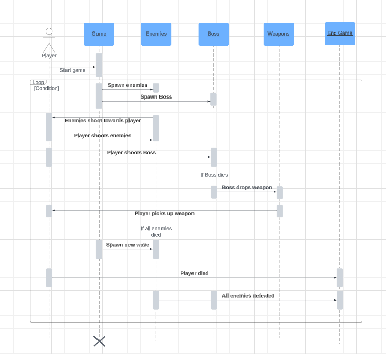
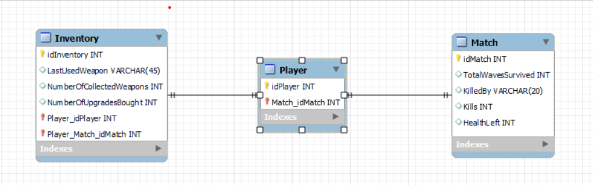
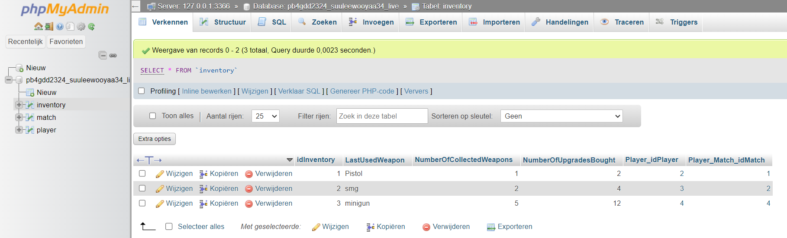

# Expert review sprint 2
## OOP
### Abstraction
Binnen OOP is abstraction het verbergen van complexe en onnodige informatie voor de gebruiker. Ik heb dit gedaan door middel van private methods en een static class die de playerPosition bijhoudt.

=== "GameState"
```csharp
    private void SpawnStandardEnemies()
    {
        Random random = new Random();

        int swap = 0;
        //For-loop om meerdere enemies aan te maken
        for (int i = 0; i < 10 * WaveCounter; i++)
        {
            int XPosition, YPosition;

            //Willekeurige posities waar de enemies spawnen
            XPosition = random.Next(0 - 100, GameEnvironment.Screen.X + 500);
            YPosition = random.Next(0 - 100, GameEnvironment.Screen.Y + 500);


            //Do-While loop die ervoor zorgt dat de enemies aan de buiten randen spawnen 
            //De swap variabele zorgt ervoor dat de enemies evenredig worden verdeel aan alle kanten
            do
            {
                if (swap % 2 == 0)
                {
                    XPosition = random.Next(0 - 100, GameEnvironment.Screen.X + 500);
                    swap++;
                }
                else
                {
                    YPosition = random.Next(0 - 100, GameEnvironment.Screen.Y + 500);
                    swap++;
                }

            } while (XPosition >= 0 && XPosition <= GameEnvironment.Screen.X && YPosition >= 0 && YPosition <= GameEnvironment.Screen.Y);

            //Aanmaken van de enemies
            shootingEnemy = new ShootingEnemy(1, 1, new Vector2(XPosition, YPosition));
            shootingEnemyList.Add(shootingEnemy);

            Add(shootingEnemy);
        }
    }

    private void EnemyShoots(ShootingEnemy shootingEnemy)
    {
        float ShootPositionX = shootingEnemy.Position.X + shootingEnemy.Width / 2;
        float ShootPositionY = shootingEnemy.Position.Y + shootingEnemy.Height / 2;
        double bulletAngle = Math.Atan2(player.Position.Y - ShootPositionY, player.Position.X - ShootPositionX);

        EnemyBullet enemyBullet = new EnemyBullet(new Vector2(ShootPositionX, ShootPositionY), bulletAngle, 15);

        enemyBulletList.Add(enemyBullet);
        Add(enemyBullet);
    }

```
=== "PlayerPositionManager" 
```csharp

    public static class PlayerPositionManager
	{
        private static Vector2 playerPosition;

        public static Vector2 PlayerPosition 
        {
            get { return playerPosition; }
            set { playerPosition = value; }
        }

 
	}
```

=== "Abstraction highlighted"
```csharp
    public static class PlayerPositionManager
	{
        private static Vector2 playerPosition;
    }
    private void EnemyShoots(ShootingEnemy shootingEnemy)
    {
    }
    private void SpawnStandardEnemies()
    {
    }
```

### Encapsulation
Binnen het project is ervoor gekozen om veel classes public te maken. Hiervoor is gekozen omdat de classes op meerdere plekken gebruikt moeten kunnen worden. Enkele methods zijn private gemaakt zoals de spawn en de shoot method. Deze methods dienen niet van buitenaf aangepast te kunnen worden.  

=== "Enemy class"  

```csharp
    // Enemy class

    public class Enemy : Character
        {
            public int EnemyMoveSpeed;
            public Vector2 steering;
            public Vector2 desired_velocity;
            public Enemy(int hitPoints, int moveSpeed, Vector2 position, string assetName, int layer = 0, string id = "", int sheetIndex = 0) : base(hitPoints, moveSpeed, position, assetName)
            {
                EnemyMoveSpeed = moveSpeed;
            }
            public void EnemySeeking(Vector2 PlayerPosition)
            {
                desired_velocity = PlayerPosition - position;
                desired_velocity.Normalize();
                desired_velocity *= EnemyMoveSpeed;

                steering = desired_velocity - velocity;

                steering = steering / 5;
                velocity = velocity + steering;
                position += velocity;
            }
        }

```
=== "GameState methods"  

```csharp
    // GameState methods
    private void SpawnStandardEnemies()
    {
        Random random = new Random();

        int swap = 0;
        //For-loop om meerdere enemies aan te maken
        for (int i = 0; i < 10 * WaveCounter; i++)
        {
            int XPosition, YPosition;

            //Willekeurige posities waar de enemies spawnen
            XPosition = random.Next(0 - 100, GameEnvironment.Screen.X + 500);
            YPosition = random.Next(0 - 100, GameEnvironment.Screen.Y + 500);


            //Do-While loop die ervoor zorgt dat de enemies aan de buiten randen spawnen 
            //De swap variabele zorgt ervoor dat de enemies evenredig worden verdeel aan alle kanten
            do
            {
                if (swap % 2 == 0)
                {
                    XPosition = random.Next(0 - 100, GameEnvironment.Screen.X + 500);
                    swap++;
                }
                else
                {
                    YPosition = random.Next(0 - 100, GameEnvironment.Screen.Y + 500);
                    swap++;
                }

            } while (XPosition >= 0 && XPosition <= GameEnvironment.Screen.X && YPosition >= 0 && YPosition <= GameEnvironment.Screen.Y);

            //Aanmaken van de enemies
            shootingEnemy = new ShootingEnemy(1, 1, new Vector2(XPosition, YPosition));
            shootingEnemyList.Add(shootingEnemy);

            Add(shootingEnemy);
        }
    }

    private void EnemyShoots(ShootingEnemy shootingEnemy)
    {
        float ShootPositionX = shootingEnemy.Position.X + shootingEnemy.Width / 2;
        float ShootPositionY = shootingEnemy.Position.Y + shootingEnemy.Height / 2;
        double bulletAngle = Math.Atan2(player.Position.Y - ShootPositionY, player.Position.X - ShootPositionX);

        EnemyBullet enemyBullet = new EnemyBullet(new Vector2(ShootPositionX, ShootPositionY), bulletAngle, 15);

        enemyBulletList.Add(enemyBullet);
        Add(enemyBullet);
    }
```

=== "Encapsulation highlighted"
```csharp
public class Enemy : Character
        {
            public int EnemyMoveSpeed;
            public Vector2 steering;
            public Vector2 desired_velocity;
            public Enemy(int hitPoints, int moveSpeed, Vector2 position, string assetName, int layer = 0, string id = "", int sheetIndex = 0) : base(hitPoints, moveSpeed, position, assetName)
            public void EnemySeeking(Vector2 PlayerPosition)
            {
            }
        }
        private void SpawnStandardEnemies()
        {
        }
        private void EnemyShoots(ShootingEnemy shootingEnemy)
        {
        }
```

### inheritance
Alle classes die ik heb aangemaakt in dit blok inheriten van een andere class. Ze nemen de methods en variabelen van andere classes over. Hieronder zijn voorbeelden weergegeven.

=== "Inheritance highlighted"
```csharp
    public class Enemy : Character
    {
    }
    public class EnemyBullet : Bullet
    {
    }
    public class ShootingEnemy : Enemy
    {
    }
    public class StandardEnemy : Enemy
    {
    }
    public class Camera : GameObject
    {
    }
    public static class PlayerPositionManager
    {
    }
```

### Polymorphism
Binnen het project worden verschillende classes herbruikt door middel van inheritance en override statements. Zo wordt de Update functie op meerdere plekken ge-override.

=== "GameState"
```csharp
        public override void Draw(GameTime gameTime, SpriteBatch spriteBatch)
        {
            spriteBatch.End();
            spriteBatch.Begin(transformMatrix: camera.Transform);
            //component.Draw(gameTime, spriteBatch);
            
            spriteBatch.End();
            base.Draw(gameTime, spriteBatch);
        }

        public override void Update(GameTime gameTime)
        {
            //foreach (var Component in components)
            //Component.Update(gameTime);

            camera.Follow(player);
            base.Update(gameTime);

            

            //Loop door de lijst met enemies
            foreach (var Enemy in shootingEnemyList)
            {
                Enemy.EnemySeeking(player.Position);

                if (Enemy.EnemyShootCooldown >= 120)
                {
                    EnemyShoots(Enemy);
                    Enemy.EnemyShootCooldown = 0;
                }
                Enemy.EnemyShootCooldown++;

                player.CheckForEnemyCollision(Enemy);
                foreach (var playerBullet in playerBulletList)
                {
                    if (playerBullet.CheckForEnemyCollision(Enemy))
                    {
                        enemiesToRemove.Add(Enemy);
                        playerBulletsToRemove.Add(playerBullet);
                    }
                }
            }

            foreach (var enemyBullet in enemyBulletList)
            {
                player.CheckForEnemyCollision(enemyBullet);
            }

            if (player.PlayerHitPoints <= 0)
            {
                GameEnvironment.GameStateManager.SwitchToState("LOSE_SCREEN_STATE");
                player.PlayerHitPoints = 3;
                ResetBullets();
            }
            if (player.InvulnerabilityCooldown >= 0)
            {
                if (player.InvulnerabilityCooldown == 0 && player.playerShield != null)
                {
                    Remove(player.playerShield);
                }
                if (player.InvulnerabilityCooldown == 119)
                {
                    Add(player.playerShield);
                }
                else if (player.InvulnerabilityCooldown <= 118 && player.InvulnerabilityCooldown > 0)
                {
                    player.playerShield.Position = player.Position + player.playerShield.Offset;
                }
            }
            foreach (var enemyToRemove in enemiesToRemove)
            {
                shootingEnemyList.Remove(enemyToRemove);
                Remove(enemyToRemove);
            }
            foreach (var playerBulletToRemove in playerBulletsToRemove)
            {
                playerBulletList.Remove(playerBulletToRemove);
                Remove(playerBulletToRemove);
            }
            if (shootingEnemyList.Count == 0 && WaveCounter != 3)
            {
                WaveCounter++;
                ResetBullets();
                SpawnStandardEnemies();
            }
            if (shootingEnemyList.Count == 0 && WaveCounter == 3)
            {
                GameEnvironment.GameStateManager.SwitchToState("WIN_SCREEN_STATE");
                ResetBullets();
                SpawnStandardEnemies();
            }
            foreach (var playerBulletToRemove in playerBulletsToRemove)
            {
                Remove(playerBulletToRemove);
                playerBulletList.Remove(playerBulletToRemove);
            }
        }
```

=== "Polymorphism hightlighted"
```csharp
    public override void Draw(GameTime gameTime, SpriteBatch spriteBatch)
    {
    }
    public override void Update(GameTime gameTime)
    {
    }
```


## UML diagrammen
### Class diagram
Gedurende het project heb ik meerdere  classes aangemaakt voor objecten en methods in de game. In onderstaand diagram is te zien hoe de classes zijn verbonden en samenwerken. Allereerst heb ik een Enemy class aangemaakt. Van deze Enemy class inheriten 2 child classes genaamd ShootingEnemy en StandardEnemy. De Enemy class inherit weer van een Character class die weer inherit van SpriteGameObject. Een andere class die ik heb aangemaakt is de Camera class. Dit object gaat de speler volgen in het level waardoor de speler vrij rond kan lopen zonder dat hij steeds tegen een border aanloopt. De Camera inherit van GameObject. De Camera is nog een work in progress. Ook heb ik een EnemyBullet class aangemaakt die inherit van een algemene Bullet class die weer inherit van RotatingSpriteGameObject. In alle classes in het diagram is te zien van welke variabelen en methods er gebruik wordt gemaakt en of ze private, protected of public zijn.  

  

### Sequence diagram
Ik heb gekozon voor een Sequence diagram zodat ik één structuurdiagram en één gedragsdiagram heb gebruikt. Dit geeft een breder inzicht in de game. De sequence diagram geeft de flow van de game goed weer. Er is te zien dat de speler het spel kan starten waarna er een level wordt ingeladen met een wave aan enemies en een boss. De enemies schieten op de player en de player kan terugschieten naar de enemies. Als de speler de boss verslaat laat hij zijn wapen vallen en kan de speler het wapen oppakken en gebruiken. Als de speler alle enemies heeft verslagen spawnt er een nieuwe wave. Als de speler al zijn levens kwijt is of als alle waves met enemies zijn verslagen is het spel voorbij.  



## Database
Voor de database heb ik een EER gemaakt in mySQL, een connection opgezet met de HBO-ICT cloud, de database gerealiseerd door middel van forward engineeren en met SQL statements data toegevoegd aan de database.  


  
  
  