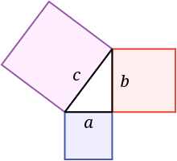

# Normalized player movement

## Probleem
Voor het maken van player movement is het gebruikelijk om een 4-key interface hiervoor te gebruiken (WASD of de 4 pijltjes). Dit zorgt ervoor dat de speler 4 kanten op kan bewegen. Dit wordt meestal op de volgende manier in code verwerkt:

```C#
if (KeyIsDown(W))
{
    Position += (0, -1)
}
if (KeyIsDown(A))
{
    Position += (-1, 0)
}
if (KeyIsDown(S))
{
    Position += (0, 1)
}
if (KeyIsDown(D))
{
    Position += (1, 0)
}
```
Deze code werkt prima als het gaat om 4-directional movement. Het is alleen ook mogelijk om meerdere keys tegelijkertijd in te drukken. Als dit twee tegengestelden zijn, dan is dit geen probleem. Maar wanneer er een combinatie van omhoog en naar rechts in wordt gedrukt, dan beweegt de speler elke frame 1 pixel omhoog EN 1 pixel naar rechts. Volgens de [stelling van pythagoras](https://suuleewooyaa34-propedeuse-hbo-ict-onderwijs-2023-379a4339aa11c7.dev.hihva.nl/Tijn/Expert/FeatureDocumentation/) betekent dit dat de speler met een snelheid van √2 pixels per frame beweegt. Dit zorgt ervoor dat de speler fysiek sneller beweegt wanneer hij/zij in een diagonale lijn beweegt. Dit zorgt voor ongewilde effecten, zoals dat de speler sneller beweegt dan de designer wilt, waardoor eventuele obstakels veel makkelijker gemaakt worden.

## Oplossing
Er is voor dit probleem gelukkig een oplossing. Allereerst moet er in plaats van een directe Position update, eerst een direction update plaatsvinden. Dit ziet er als volgt uit:
```C#
var Direction = new Vector2(0, 0)
if (KeyIsDown(W))
{
    Direction += (0, -1)
}
if (KeyIsDown(A))
{
    Direction += (-1, 0)
}
if (KeyIsDown(S))
{
    Direction += (0, 1)
}
if (KeyIsDown(D))
{
    Direction += (1, 0)
}
Position += Direction
```
Door deze verandering is de position niet meer ge-'hardcode' binnen de playerMovement funtie, maar wordt deze geupdate aan de hand van de direction. Deze direction wordt elke frame weer aan het begin van de functie naar (0, 0) gezet, zodat er niet opeens een dubbele snelheidsmove gedaan wordt. De stelling van pythagoras zorgt er helaas nog steeds voor dat de diagonale movement √2 keer zo snel is als horizontaal of verticaal. Om ervoor te zorgen dat dit niet gebeurd, moet de stellen van pythagoras dus teruggedraaid worden. De ingebouwde functie bij Vector2 genaamd Normalize() komt hier heel goed van pas, want deze doet precies wat nodig is.

```C#
public void Normalize()
    {
        float num = 1f / MathF.Sqrt(X * X + Y * Y);
        X *= num;
        Y *= num;
    }
```

Deze functie kan direct worden uitgevoerd op elke Vector2 (en dus ook de Direction). Er moet wel gecheckt worden of de Direction vector niet aangepast is, anders wordt er voor niks genormaliseerd. Vector2.Zero = Vector2(0, 0)

```C#
var Direction = new Vector2.Zero
if (KeyIsDown(W))
{
    Direction += (0, -1)
}
if (KeyIsDown(A))
{
    Direction += (-1, 0)
}
if (KeyIsDown(S))
{
    Direction += (0, 1)
}
if (KeyIsDown(D))
{
    Direction += (1, 0)
}
if (Direction == Vector2.Zero) return;
Direction.Normalize();
Position += Direction
```

Uitgewerkt in onze eigen game ziet het er dan als volgt uit:

```C#
private void CheckForMovementInputs(InputHelper inputHelper)
{
    var dir = Vector2.Zero;
    base.HandleInput(inputHelper);
    if (inputHelper.IsKeyDown(Keys.W) && Position.Y > 0)
    {
        dir.Y = -1;
    }
    if (inputHelper.IsKeyDown(Keys.A) && Position.X > 0)
    {
        Sprite.SheetIndex = 1;
        dir.X = -1;
    }
    if (inputHelper.IsKeyDown(Keys.S) && Position.Y < GameEnvironment.Screen.Y - Height)
    {
        dir.Y = 1;
    }
    if (inputHelper.IsKeyDown(Keys.D) && Position.X < GameEnvironment.Screen.X - Width)
    {
        Sprite.SheetIndex = 0;
        dir.X = 1;
    }
    if (dir == Vector2.Zero) return;
    dir.Normalize();
    Position += dir * MoveSpeed;
}
```

## Referentie en bronnen

### Stelling van pythagoras
De stelling van pythagoras luidt: a^2 + b^2 = c^2 (wanneer er sprake is van een rechthoekige driehoek). In movement betekent dit dat a de horizontale movement is en b de verticale, waaruit c de diagonale movement is, en dus een opsomming van de kwadraten van de verticale en horizontale snelheid.



### Normalisering van vectoren voor 8-directional player movement

[Normalizing vectors for 8-directional player movement](https://stackoverflow.com/questions/66783761/how-can-i-normalize-my-diagonal-movement-in-monogame)