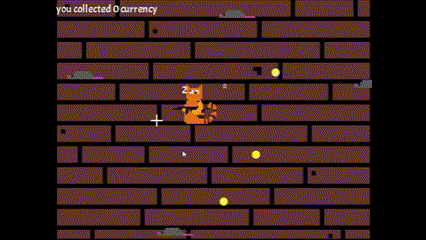

# Sprite animations

## Probleem
Als er art geimplementeerd wordt in een game, wordt dit in het begin gedaan aan de hand van .png files. Dit zijn stilstaande plaatjes die ingeladen kunnen worden. Ze kunnen aan de hand van code aan een object toegevoegd worden om op het scherm gedisplayed te worden.

```C#
public Texture2D GetSprite(string assetName)
{
    if (assetName == "")
    { 
        return null;
    }
    return contentManager.Load<Texture2D>(assetName);
}
```

Met deze code kan een .png file ingeladen worden aan de hand van de assetName. Deze wordt opgehaald uit de contentManager en wordt meegegeven aan een object.

```C#
public Currency(Vector2 position, string assetName = "Images/UI/animalCoin") : base(assetName)
{
    Position = position;
}
```

Hierin wordt de animalCoin.png meegegeven aan een currency object. De .png hoeft hier niet meegegeven te worden omdat de library deze niet nodig heeft om het plaatje in te laden.

Het gebruik van single-frame plaatjes is handig tijdens het developmentproces, maar het kan ervoor zorgen dat het spel minder levendig overkomt.
## Oplossing
De oplossing voor dit probleem, is het gebruik van animaties voor bepaalde objecten. Dit kan worden bereikt door het gebruik van spritesheets. Dit is 1 .png file, waarin meerdere plaatjes zijn verwerkt en overheen wordt gecheckt aan de hand van een index die begint bij 0.

```C#
public Currency(Vector2 position, string assetName = "Images/UI/animalCoin@2x2") : base(assetName)
{
    Position = position;
}
```

In deze code is de spritesheet animalCoin@2x2.png geimplementeerd. De 2x2 geeft de grootte van de spritesheet aan, in dit geval 4 verschillende plaatjes. Er wordt hiervoor ook een animatiefunctie aangeroepen die door alle indexes van de spritesheet heen loopt.

```C#
private void DoAnimation()
{
    var Switcher = Math.Floor((float)(animationTimer / 6));
    animationTimer += animationCounter;
    switch (Switcher) 
    {
        case -1:
            animationCounter = 1;
            return;
        case 0:
            Sprite.SheetIndex = 0;
            return;
        case 2:
            Sprite.SheetIndex = 1;
            return;
        case 4:
            Sprite.SheetIndex = 2;
            return;
        case 6:
            Sprite.SheetIndex = 3;
            return;
        case 7:
            animationCounter = -1;
            return;
    }
}
```

Hier wordt een multiplier van 2 gebruikt op de Switcher, zodat elke frame net zo lang wordt gedisplayed. Met een modifier van 1 wordt er namelijk te lang op de uiteindes van de spritesheet gebleven. De animatie ziet er in het spel als volgt uit.



Dit geeft de speler een onbewust gevoel om de currency op te pakken omdat de muntjes bewegen op het scherm. Ook ziet het er leuker uit dan een statisch plaatje.
## Referentie en bronnen