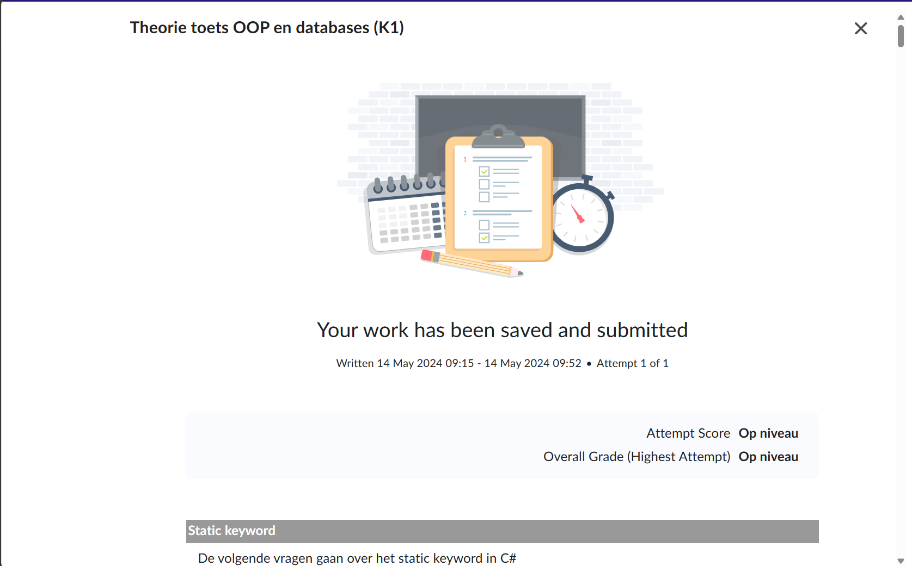

# LinkedIn course summary

## C# Data structures

### Inleiding

Deze samenvatting gaat over de [linkedIn-course Data Structures](https://www.linkedin.com/learning/c-sharp-applied-data-structures/). Hierin wordt de theorie rondom Data Structures in het kort verteld.

### Samenvatting van de cursus in ongeveer 300 woorden
- Strings cannot be modified once they are created; immutable
- Arrays are contiguous storage in memory of the same variable type
- Tuples are used to group together multiple data elements without having to define a class
- Contains checks for presence of a certain value in a List, Exists does checking for conditions, like string length, to figure out whether or not something exists in the list that the user is looking for
- Find and FindAll can be used to check a value of something in a list, instead of returning a boolean
- TrueForAll returns true when every value in a list meets a certain requirement
- LinkedList works in sequence, instead of with an index like List
- LinkedListNodes are points in a linked list that are set by the user, and any value can be added, removed or checked before and after these nodes
- Lists vs LinkedList: Lists are faster at looking up items, as well as adding items at the end of the list. LinkedList is best used when adding / removing items from the last and first positions of the list
- Stack is a type of list that uses the last in, first out principle to store and remove data
- Queue is a type of list that uses the first in, first out principle to store and remove data
- They both have overlapping functions, such as Contains and Count, and differing functions, such as Pop and Push for stack, and Enqueue and Dequeue for queue
- Dictionary gives a way to associate keys with individual values. There can be multiple keys with the same value, but not the other way around
- Dictionary has the Count method, as well as a few different ones like ContainsKey, ContainsValue, Add and Remove
- ListDictionary implements a dictionary as a linked list, which is faster up to about 100 elements
- HybridDictionary starts out as a ListDictionary, until that is no longer faster, and then switches to a Dictionary
- OrderedDictionary keeps entries in the dictionary in order of when they were added
- StringCollection is used to modify and manipulate groups of string objects. It is also indexed like an array
- StringBuilder is more efficient at modifying strings multiple times than string functions

### Relevantie tot je project en praktische toepassing
Voor onze game is het gebruik van Lists extreem belangrijk. Lists worden voornamelijk gebruikt in de gamestate class, om objecten toe te voegen aan de GameObjectList (dit is een soort List, die uniek is aan deze codebase). De GameObjectList loopt door alle elementen in de list heen om functies uit te voeren als de Update en HandleInput. Voor het toevoegen van elementen aan de lijst wordt Add() gebruikt, en Remove() om elementen weg te halen. Elementen die in de lijst staan worden gedisplayed in de gamestate. Naast de GameobjectList voor de gamestate, gebruiken we ook reguliere Lists.

```C#
private List<PlayerBullet> playerBulletList;
private List<PlayerBullet> playerBulletsToRemove;
private List<EnemyBullet> enemyBulletList;
private List<ShootingEnemy> shootingEnemyList;
private List<GameObject> toRemoveList;
```

Deze lijsten zijn vrij vanzelfsprekend; playerBulletList is een lijst voor alle playerbullets, etc. De toRemoveList is een lijst voor alle objecten van het type GameObject. Deze wordt gebruikt om objects te verwijderen na een foreach loop over de lijst heen. Dit hebben wij zo gecodeerd, aangezien het verwijderen van elementen uit een lijst tijdens een loop zorgt voor een crash.

```C#
foreach (var playerBullet in playerBulletList)
{
    if (playerBullet.CheckForEnemyCollision(Enemy))
    {
        toRemoveList.Add(Enemy);
        toRemoveList.Add(playerBullet);
    }
}
```

De code hierboven laat een collision check plaatsvinden tussen enemies en playerBullets. Omdat er een foreach over de playerBulletList wordt uitgevoerd, kunnen hier niet direct elementen uit verwijderd worden. Daarom worden deze later verwijderd.

```C#
foreach (var gameObject in toRemoveList)
{
    if (gameObject is PlayerBullet playerBullet)
    {
        playerBulletList.Remove(playerBullet);
    }
    if (gameObject is ShootingEnemy shootingEnemy)
    {
        shootingEnemyList.Remove(shootingEnemy);
    }
    Remove(gameObject);
}
```
### Resultaten LinkedIn Learning cursus
[Bewijs van LinkedIn-course voltooiing](https://www.linkedin.com/learning/me/my-library/completed?u=2132228)

### Resultaten quiz op DLO


### Vragen voor expert review
Is er een manier om ervoor te zorgen dat er wel elementen uit een lijst verwijderd kunnen worden tijdens een foreach loop? Zo niet, is er een mogelijkheid om de foreach loop door de toRemoveList schoner te schrijven, zodat er niet bij elke nieuwe gameObject soort een loop hoeft worden uitgevoerd?