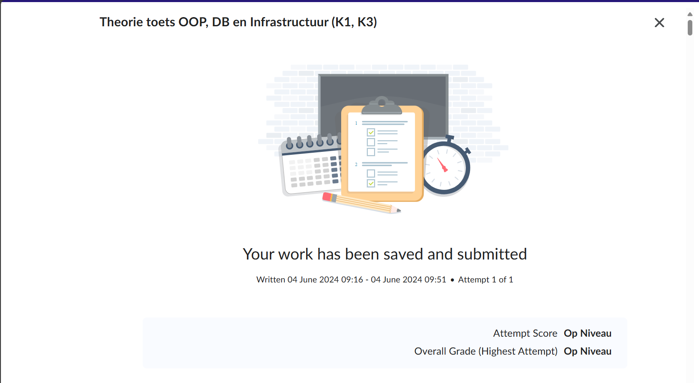

# C# Relational databases summary

## Inleiding

Deze samenvatting gaat over de [linkedIn-course Relational Database](https://www.linkedin.com/learning/relational-databases-essential-training/). Hierin wordt de theorie rondom Relational Databases in het kort verteld.

## Samenvatting van de cursus in ongeveer 300 woorden

Relational database are the most popular way to manage data, because it is stored efficiently, information is quickly retrievable and the databases are very flexible.
Recording information has always been important to humans.
Storing files (like pictures) using folder hierarchy is functional to a degree, but adding data onto the files is very tedious work.
Storing data in tables is much more efficient, because multiple types of data (like the picture, date of photo taken and photographer) can be linked together in the table.
Table structure pros: Attributes can be added with more columns, easily growable (future-proof).
Table structure cons: Repetitive information storage, not flexible to special circumstances.
Solution to the cons is to create multiple tables that are relationalized with each other, but serve a different purpose each.
Tables are linked with each other via keys, where a key is an identifier to other data that comes with it.
Keys can be confusing to the user, but luckily, the computer does the searching from key to data for us.

Relation database modifying software (RDBMS) can do two things:
- Create and modify the structure of all the data
- Create, read, update and delete data from the relational database
SQL is used to interact with the RDBMS's
One of the methods (that we use too) is creating ERD's. It helps to create the structure without requiring data.
It's important to define data types for each columns, otherwise data storage will take more space,
it will know beforehand what data type is going to be sent which will improve the quality of the data.
Different types: (var)char, (tiny)int, decimal/float, dates/currencies, binary files and even geographic coordinates.
Primary keys are identifiers that are, and will be, unique.
Natural keys are identifiers that are already present in the table.
Composite keys are multiple columns that combine to be an identifier.
Surrogate keys are self-made identifiers, that have no real reason to exist outside of identifying.
Records in tables can be checked for integrity by the tables. The user will then get an error to try again with new data.
Auto-increment makes sure an int value is automatically raised every time a record is created. This is used for primary keys.

Putting up constraints for columns can help with displaying the same data types across all records.
Null = no data, columns can be set to allow null values
Columns that are required, cannot be null.
A defaut value is used to make sure columns are not entered with a null value, even though the user did not enter any data.
Indexes are used to simplify data reading from a database by using a more easily searchable index.
Usually used in frequently searched columns, like primary keys.
Adding unnecessary indexes can slow down the database.
Constraint checks can be used on every column on self-set constraints, like a range of a number.

Foreign keys are primary keys from one table, used in another table.
Foreign keys are linked to another table with the same data type.
Optionality is the minimum requirement for a table-table relation. This can be 0 or 1.
Cardinality is the maximum requirement for a table-table relation. This can be 0, 1 or infinite.
Multiplicity is the range between optionality and cardinality.
One to many relationship is a table-relation, where the unique identifier of one table is linked to a non-unique identifier of another table.
One to one relationship is a table-relation, where unique identifiers are linked to each other.
Many to many relationship is a table-relation, where a non-unique identifier is linked to another non-unique identifier.
A many-many relation is very hard to implement, which is why many-many relations are replaced with a linking table, that uses both of the unique identifier to link them together.
Self joins are relationships between two columns in one table.
Cascading updates are used to update values, for both the primary key in a table, and a foreign key for another table.
This can also be used when deleting records from the primary table, which will delete records that use that same record from the foreign table.

Normalization is a sequential number of rules that your database structure must adhere to, to be considered a 'good' structure.
1NF is to never have multiple points of data in 1 column. This can be fixed using relational tables.
2NF is to have just one column to be your primary key.
3NF is to have every column work independently; no column is dependant on another column.
Denormalization is the process where a designer actively moves against the NF's used in normalization, to increase performance.

Queries are used to do everything around data in databases. Add tables/records, updating tables/records, reading records and deleting tables/records.
CREATE TABLE PlaceholderTableName (ColumnID int PRIMARY KEY NOT NULL, Column1 varchar, etc.);
ALTER TABLE PlaceholderTableName ADD Column2 date NOT NULL;
DROP TABLE PlaceholderTableName;
Data manipulation commands (DML) are used to modify data in a database.
INSERT INTO PlaceholderTableName VALUES (ColumnID value, Column2 value, etc.), VALUES (ColumnID value, Column2 value, etc.);
UPDATE PlaceholderTableName SET PlaceholderColumnName = "Column3" WHERE ColumnID = 1;
DELETE FROM PlaceholderTableName WHERE ColumnID = 1;
SELECT * FROM PlaceholderTableName WHERE ColumnID = 1;
SELECT * PlaceholderTableName.Column1, PlaceholderTableName2.Column2 FROM PlaceholderTableName INNER JOIN PlaceHolderTableName2 ON PlaceHolderTableName.ColumnID = PlaceHolderTableName2.ColumnID;
CREATE VIEW PlaceHolderView AS {insert your select query here}
SELECT * FROM PlaceHolderView

Graph database store information in objects (nodes) or relationships (edges). Nodes can have edges with any node.
Document Database store individual files that contain information about a single objects. The files can be read and categorized, and information about each object is stored in the files.
These databases are called NoSQL Databases, but are more non-relational than they are non-SQL.

## Relevantie tot je project en praktische toepassing

Onze game maakt direct gebruik van een database connectie. Dit is handig om analytics bij te houden over bepaalde zaken in de game, zoals upgrades die vaker gekocht worden dan andere upgrades, cause of death en tijd die de speler nodig heeft om bepaalde levels te halen.
[Leg uit hoe de theoretische concepten die in deze cursus worden behandeld direct of indirect verband houden met jouw project. Benadruk specifieke gebieden waar kennis die is opgedaan uit de cursus is toegepast of zal worden toegepast in het ontwikkelingsproces. Geef hier voorbeelden van en benoem hoe deze relevant zijn.]

## Resultaten LinkedIn Learning cursus

[Bewijs van LinkedIn-course voltooiing](https://www.linkedin.com/learning/me/my-library/completed?u=2132228)

## Resultaten quiz op DLO

## Vragen voor expert review

[Stel drie concrete vragen op die je tijdens de expert review wil behandelen. Deze vragen zijn gericht op het verkrijgen van feedback en inzichten van de beoordelaar.]
