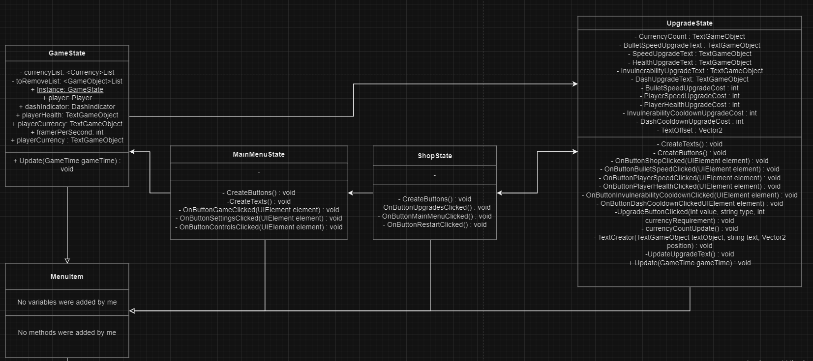
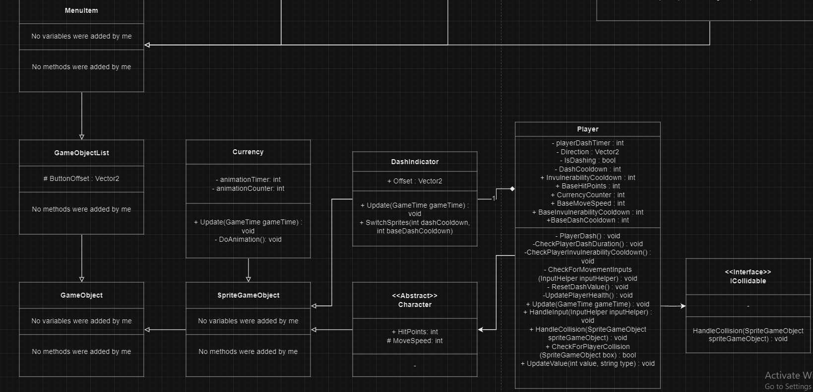
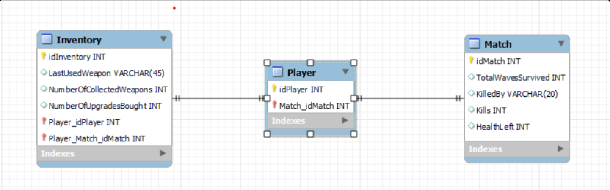

# Expert review sprint 3

## Linked-in course samenvattingen

- [Data structures samenvatting](../Expert/LinkedInSummaries/data-structures.md)
- [Design principles samenvatting](../Expert/LinkedInSummaries/design-principles.md)
- [Generics and interfaces samenvatting](../Expert/LinkedInSummaries/generics-and-interfaces.md)
- [Relational databases samenvatting](../Expert/LinkedInSummaries/relational-database.md)

## 4 pillars of OOP

### Basics van Object-Oriented Programming

De basis van object georienteerd programmeren ligt in het plaatsen van code in objecten, zodat deze zo compact mogelijk geschreven wordt. De code wordt, door gebruik van OOP, overzichterlijker, omdat code georganiseerd staat in verschillende objecten. OOP wordt gekenmerkt door 4 basisprincipes: abstraction, encapsulation, inheritance en polymorphism.

### Abstraction

Abstraction houdt in dat herhaalde code geinitialiseerd wordt in een functie. Hierdoor blijft de code beter leesbaar, compacter en efficient, terwijl het ook makkelijker is om specifieke regels code op te roepen als gebruiker.

=== "Method in player to update values whilst being abstracted"
    ```C#
    public class Player : Character, ICollidable
    {
    //all variables and methods for the player

    public void UpdateValue(int value, string type)
        {
            switch (type)
            {
                case "HitPoints":
                    HitPoints += value;
                    GameState.Instance.playerHealth.Text = $"{HitPoints}";
                    break;
                case "MoveSpeed":
                    BaseMoveSpeed += value;
                    MoveSpeed += value;
                    break;
                case "InvulnerabilityCooldown":
                    BaseInvulnerabilityCooldown += value;
                    break;
                case "DashCooldown":
                    BaseDashCooldown -= value;
                    break;
            }
        }
    }
    ```

=== "UpdateValue used in another file"
    ```C#
    public class UpgradeState : MenuItem
    {
        //types that can be given as parameters: "HitPoints, "MoveSpeed", "InvulnerabilityCooldown" & "DashCooldown".
        private void UpgradeButtonClicked(int value, string type, int currencyRequirement)
        {
            if (GameState.Instance.player.currencyCounter < currencyRequirement) return;
            GameEnvironment.AssetManager.AudioManager.PlaySoundEffect("button_agree");
            GameState.Instance.player.UpdateValue(value, type);
            GameState.Instance.player.currencyCounter -= currencyRequirement;
            UpdateUpgradeText();
            nextScreenName = "UPGRADE_STATE";
            ButtonClicked();
            Console.WriteLine($"{currencyRequirement} currency was removed from the player");
        }
    }
    ```

Hierboven is een functie klaargezet in de player om bepaalde waarden te veranderen die de player heeft. Aangezien deze private zijn, kunnen deze niet direct gerefereerd worden in de UpgradeState. Via deze functie kunnen deze waarden alleen aangepast worden via het systeem van de functie (met parameters van het type stat, etc.). Hierdoor wordt verkeerd gebruik van de functie vermeden. Ook kunnen beschermde variablen niet aangepast worden zonder correct gebruik van de functie.

### Encapsulation

Encapsulation houdt in dat variablen en functies, die specifiek aan een object zijn, gebundeld worden in een class. Hierdoor wordt initialisatie van een object, die meerdere keren wordt gecreeerd, een stuk simpeler.

=== "Animation van currency"
    ```C#
    public class Currency : SpriteGameObject
    {
        public override void Update(GameTime gameTime)
        {
            base.Update(gameTime);
            DoAnimation();
        }

        private void DoAnimation()
        {
            //logic that loops through each sprite in the spritesheet for equal time, using a local variable called switcher
        }
    }
    ```

De animatie van elke currency is weggestopt in de logica van de currency zelf. Hierdoor is niks van invloed op de animatie van de currency. Ook is het voor elke currency apart geregeld, waardoor de animaties allemaal los van elkaar verlopen.

### Inheritance

Inheritance houdt in dat een class functies overerft van een andere class. Ook kan de nieuwe class de functies veranderen, en nieuwe functies krijgen die de oude class niet heeft.

=== "Character has the variable HitPoints, and gives it to all classes that inherit from it"
    ```C#
    public abstract class Character : SpriteGameObject
    {
        //all variables that a character needs
        public int HitPoints;
    }
    ```

=== "Player inherits HitPoints from Character"
    ```C#
    public class Player : Character, ICollidable
    {
        //variable declaration happens here
        public Player(int hitPoints, int moveSpeed, Vector2 position) :
                      base(hitPoints, moveSpeed, position, "Images/Characters/playerCat@2x1", 0, " ", 0)
        {
            HitPoints = hitPoints;
        }
    }
    ```

=== "Enemy inherits HitPoints from Character"
    ```C#
    public class Enemy : Character
    {
        //variable declaration happens here
        public Enemy(int hitPoints, int moveSpeed, Vector2 position, string assetName, int layer = 0, string id = "", int sheetIndex = 0) :
                     base(hitPoints, moveSpeed, position, assetName)
        {
            EnemyMoveSpeed = moveSpeed;
        }
    }
    ```

Hier wordt de variable HitPoints meegegeven aan elke class die ook een Character is. Zoals hierboven te zien gebruikt de player class direct de variable hitPoints om via de constructor HitPoints te declareren. Bij de enemy class hebben wij nog geen health systeem ingebouwd, dus die hoeft deze variable niet te inheriten.

### Polymorphism

Polymorphism de laatste van de 4 pillaren van OOP. Het is de techniek, waarbij een overgeerfde class, een functie kan aanpassen en op zijn eigen manier kan gebruiken. Meestal wordt dit gedaan aan de hand van abstracte classes of interfaces.

=== "Interface ICollidable"
    ```C#
    public interface ICollidable
	{
		void HandleCollision(SpriteGameObject spriteGameObject);
	}
    ```

=== "Player inherits ICollidable and is forced to use HandleCollision"
    ```C#
    public class Player : Character, ICollidable
    {
        //handles player collision with spritegameobjects, using a switch-case to correctly handle the collision based on the type of spritegameobject
        public void HandleCollision(SpriteGameObject spriteGameObject)
        {
            if (CollidesWith(spriteGameObject) == false) return;
            switch (spriteGameObject)
            {
                case Enemy:
                    if (InvulnerabilityCooldown <= 0)
                    {
                        UpdatePlayerHealth();
                    }
                    break;
                case EnemyBullet:
                    if (InvulnerabilityCooldown <= 0)
                    {
                        UpdatePlayerHealth();
                    }
                    break;
                case Currency:
                    currencyCounter++;
                    GameState.Instance.playerCurrency.Text = $"you collected {currencyCounter} currency";
                    GameState.Instance.toRemoveList.Add(spriteGameObject);
                    break;
            }
        }
    }
    ```

Met het gebruik van deze interface kunnen spritegameobjects die collision nodig hebben, alleen bestaan als ze ook echt een functie hebben voor de collision. Ook kunnen verschillende classes deze functie op hun eigen manier interpreteren.

## Klassendiagram van mijn toevoeging

Hieronder is een gecombineerde klassendiagram te zien van mijn toevoeging aan het project. Hierin is gekeken naar classes waar ik een substantieel deel aan heb bijgedragen, met name de upgrade state en de player.




## UML

## EER en database

De database connectie die wij gebruiken in onze game is enkel afgestemt op het verkrijgen van analytics over onze game. Dit hebben wij gedaan, aangezien ons spel singleplayer gespeelt wordt. Voor analytics wordt met name gekeken op doodsoorzaak, tijd overleeft, verste level gehaald en upgrades die gehaald zijn. Door deze data kunnen we eventueel bepaalde enemies sterker/zwakker maken, en hetzelfde geldt voor upgrades die buffs/nerfs nodig hebben, afhankelijk van buy-rate.



Voor het versturen van data naar de database gebruiken, gebruiken wij een query die verstuurd wordt, zodra de speler al zijn/haar levens verliest. Deze query ziet er als volgt uit (voor de query gebruiken we momenteel nog dummy-data om op te sturen).

```C#
if (player.HitPoints <= 0)
{
    Retry();
    GameEnvironment.GameStateManager.SwitchToState("LOSE_SCREEN_STATE");
    SocketClient.Instance.SendDataPacket(new MatchData{
        TotalWavesSurvived = 2,
        KilledBy = "rat",
        Kills = 4,
        HealthLeft = 0
    });
}
```

Hierdoor wordt er elke keer dat een speler al zijn/haar levens verliest, een record naar de database verstuurd, waarin de TotalWavesSurvived, KilledBy en Kills worden meegegeven.
